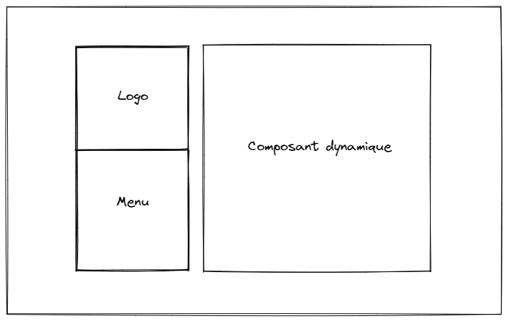
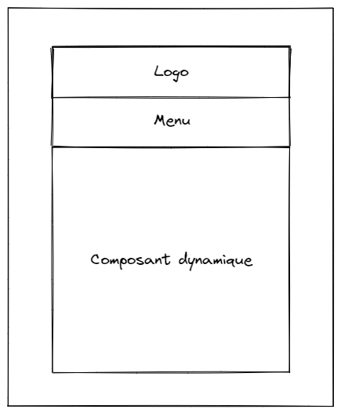

# Frontend repository pour mon portfolio

Portfolio sous format d'une page unique. 

## Stack

Projet développé en utilisant [Angular](https://github.com/angular).  
Angular material pour certains composants.  
[Tailwind](https://tailwindcss.com/) pour le style.  

Langages présents dans le projet: Javascript / Typescript / HTML / CSS.

## Structure du site 

#### Vue ordinateur

#### Vue mobile

  
  
Le menu se présente sous le format d'une liste. La sélection d'un de ses éléments met à jour le composant dynamique, qui affiche l'élément qui y correspond.  
La composition de la page se présente en deux parties, la première étant le logo ainsi que le menu et la deuxième le composant dynamique.  
En vue ordinateur, ces deux parties sont côte à côte, tandis qu'en vue mobile, le logo et le menu sont disposées au dessus du composant dynamique.  
  
## Composant dynamique

Le composant dynamique est en faites un des 4 composants suivants: 
* Accueil
* A propos
* Stack
* Avis

qui est affiché de manière conditionnel en fonction du choix de l'utilisateur dans le menu.
